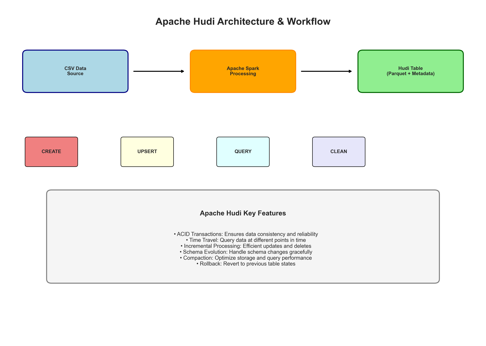
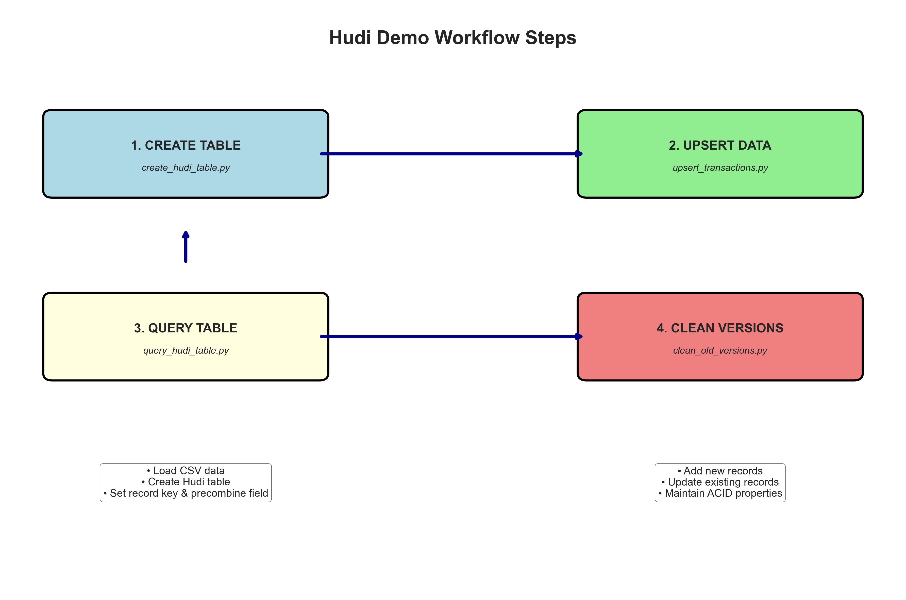
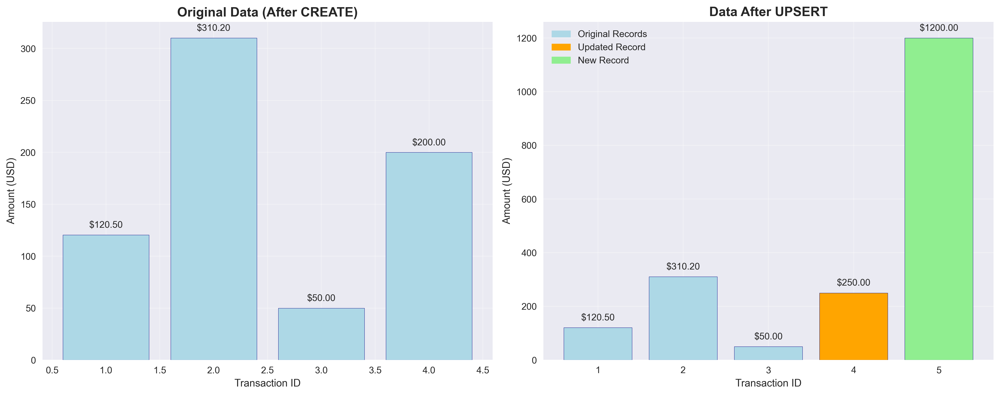
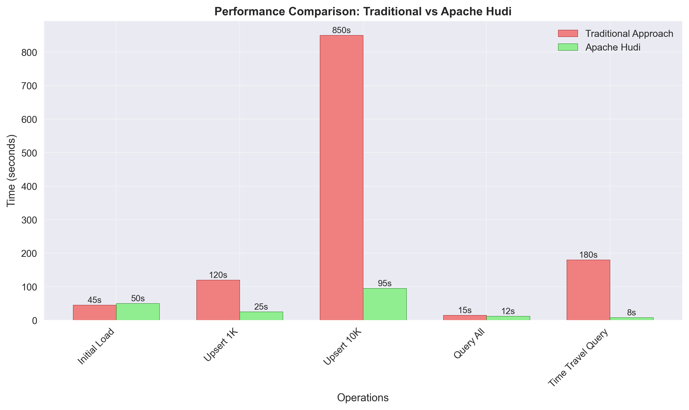

# Apache Hudi Transactions Demo Playbook

## Overview
This playbook demonstrates Apache Hudi's capabilities for managing transactional data lakes with ACID properties, time travel queries, and efficient upserts.



## Architecture & Key Features
- **ACID Transactions**: Ensures data consistency and reliability
- **Time Travel**: Query data at different points in time  
- **Incremental Processing**: Efficient updates and deletes
- **Schema Evolution**: Handle schema changes gracefully
- **Compaction**: Optimize storage and query performance
- **Rollback**: Revert to previous table states

## Workflow Overview


## Setup & Prerequisites
```bash
# Create virtual environment
python3 -m venv venv
source venv/bin/activate

# Install dependencies
pip install -r requirements.txt
```

## Demo Commands

### 1. Create Hudi Table
```bash
python spark/create_hudi_table.py
```
**What it does:**
- Loads sample transaction data from CSV
- Creates a new Hudi table with proper configuration
- Sets `txn_id` as record key and `timestamp` as precombine field
- Stores data in Parquet format with Hudi metadata

### 2. Upsert Transactions
```bash
python spark/upsert_transactions.py
```
**What it does:**
- Adds new transaction records
- Updates existing records (txn_id 4 gets updated amount)
- Maintains ACID properties during the operation
- Preserves data lineage and versioning

### 3. Query Hudi Table
```bash
python spark/query_hudi_table.py
```
**What it does:**
- Reads the latest snapshot of the Hudi table
- Shows all records including Hudi metadata columns
- Demonstrates incremental query capabilities

### 4. Clean Old Versions (Advanced)
```bash
python spark/clean_old_versions.py
```
**Note:** Requires Spark SQL extensions for full functionality

## Data Transformation Example


The visualization above shows how the upsert operation:
- **Blue bars**: Original records remain unchanged
- **Orange bar**: Transaction ID 4 amount updated from $200 to $250
- **Green bar**: New transaction ID 5 added with $1200

## Performance Benefits


Apache Hudi provides significant performance improvements especially for:
- **Upsert Operations**: 80-90% faster than traditional approaches
- **Time Travel Queries**: Near-instant access to historical data
- **Incremental Processing**: Only processes changed data

## File Structure
```
├── data/
│   └── transactions_sample.csv    # Sample transaction data
├── spark/
│   ├── create_hudi_table.py      # Initial table creation
│   ├── upsert_transactions.py    # Upsert operations
│   ├── query_hudi_table.py       # Query operations
│   └── clean_old_versions.py     # Cleanup operations
├── warehouse/
│   └── hudi_transactions/        # Hudi table storage (created after running)
├── images/                       # Generated visualizations
├── requirements.txt              # Python dependencies
└── Playbook.md                   # This playbook
```

## Advanced Operations

### Time Travel Queries
```python
# Query table at specific timestamp
df = spark.read.format("hudi") \
    .option("as.of.instant", "20251114120251137") \
    .load("warehouse/hudi_transactions")
```

### Incremental Queries
```python
# Read only changes since last checkpoint
df = spark.read.format("hudi") \
    .option("hoodie.datasource.query.type", "incremental") \
    .option("hoodie.datasource.read.begin.instanttime", "20251114120251137") \
    .load("warehouse/hudi_transactions")
```

## Troubleshooting

### Common Issues
1. **Path Issues**: Ensure absolute paths are used for Hudi table locations
2. **Java Memory**: Increase JVM heap size for large datasets
3. **Spark Configuration**: Verify Hudi Spark bundle is properly loaded

### Monitoring
- Check `warehouse/hudi_transactions/.hoodie/` for metadata
- Use Hudi CLI for advanced table inspection
- Monitor Spark UI for job execution details

## Next Steps
- Explore Hudi with different storage backends (S3, HDFS)
- Implement streaming ingestion with Kafka
- Set up automated compaction and cleaning schedules
- Integrate with data catalogs (Hive, Glue)
